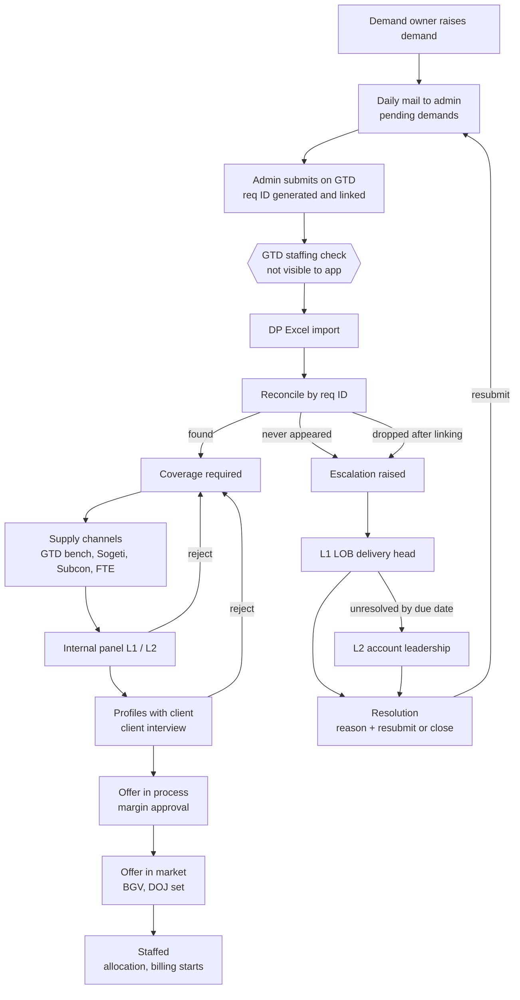
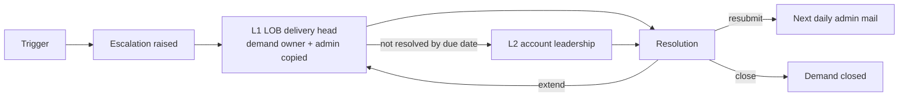

# Demand Tracker — Application Flows

Version 1.0 · 23 Sep 2026
Scope: tracking client positions (demands) from the moment a demand owner raises them until the candidate is onboarded and billing starts. Built for Discover NA first, but every client-specific rule is account configuration so the same app works for any client.

---

## 1. Personas

| Persona | Login scope | Responsibilities in the app |
|---|---|---|
| Demand owner | Own demands (optionally read-only across own BU) | Raises demands for any grade or practice from their BU (CARDS, BANKING, PAYMENTS, DATA). Owns each demand until the person is onboarded. |
| Admin demand owner | All demands, all BUs | Submits demands on GTD and records the requisition ID. Uploads the DP sheet and resolves reconciliation. Approves offers with margin ≥ 30%. Maintains the vendor rate card. Liaises with demand owners, DPs and staffing. Handles L1 escalations with the LOB delivery head. |
| Leadership | Whole account, read-only dashboards | Watches fill speed and revenue lost to missed start dates. Resolves L2 escalations. Approves below-margin exceptions. |
| Interviewer | Only interviews assigned to them | Receives alerts for requisitions in their skill area, conducts interviews, submits feedback and a select/reject decision. |

Outside the app (no login): GTD staffing, DPs, practice/sourcing teams. Their output reaches the app only through the DP Excel sheet.

### 1.1 Access control (User access page)

Every user has limited access **except** the admin demand owner and leadership, who always see the full account. The admin controls everyone else's access from the **User access** page.

| Role | Default visibility | Admin can change |
|---|---|---|
| Demand owner | Own demands | Widen to own + BU read-only |
| Interviewer | Assigned interviews + alerts for new requisitions in their skills | Skills, practices, max grade, BUs |
| Admin demand owner | Full account, all BUs | Fixed |
| Leadership | Full account, all BUs | Fixed |

User details captured by the admin: name, email, role, account, business unit(s), practice(s), level, visibility scope, interviewer skills (interviewers only), active / inactive.

Flow:
1. Admin opens **User access** → **Add user**, fills the details above.
2. The role sets the default visibility; the admin adjusts it where the role allows.
3. The user's menu and data are filtered by role and scope on every screen and API call.
4. Deactivating a user removes access immediately; their demands and history stay.

### 1.2 Prototype view switcher (until login is built)

Login is out of scope for now. Every screen has a **View as** dropdown (Demand owner, Admin demand owner, Leadership, Interviewer) that switches the whole app to that persona's menu and data scope. It is a development aid only and is removed when SSO login lands.

### 1.3 Seed data

All seeded data belongs to **one account: Discover NA**. Multi-account behavior stays in the design but is not seeded or tested until the second-account phase.

---

## 2. End-to-end flow

---

## 3. Flow 1 — Demand intake (demand owner)

1. Demand owner opens **Raise demand** and fills the form (fields in §3.1).
2. Save → status `draft`; the app assigns a permanent app reference, e.g. `DM-000142`.
3. Submit → status `submitted`. The demand is queued for the next daily admin mail.
4. Demand owner sees every status change on **My demands** and is copied on escalations for their demands.

One demand = one position. Bulk needs (e.g. 7 × Java Full Stack) are created as 7 demands; the form may offer a "number of positions" field that creates N demands.

### 3.1 Intake fields

| Group | Field | Notes |
|---|---|---|
| Position | Account | Pre-set from the user's account |
| | Business unit | CARDS, BANKING, PAYMENTS, DATA (per-account list) |
| | Practice | CCA-FS, DCX-FS, DMN-FS, TES-FS, ADM-FS … |
| | Demand request name | Sent to GTD prefixed with the app ref: `[DM-000142] …` |
| | Grade | Drives rate card and margin |
| | Category | Open / Proactive (proactive covers shadow, bench, NGT) |
| | Type | New / Replacement (replacement captures who is being replaced) |
| | Position type | Billable / Non-billable |
| Requirements | Primary / secondary skills | Tags; used for interviewer routing and bench matching |
| | Experience | Min–max years |
| | Job description | File upload |
| Commercial and timing | Client bill rate | Restricted to admin and leadership views |
| | Requested start date | Anchor for loss calculation |
| | Region, location, work mode | US / CA; city; onsite / hybrid / remote |
| | Client hiring manager | Text |
| Per-account extras | Custom fields | Stored as JSON, configured per account |

---

## 4. Flow 2 — Admin notification and GTD submission

Submission to GTD is manual, so the app's job is to prompt the admin and capture the result.

1. At a configured time each day, the app emails the admin the list of demands in `submitted` status (status → `notified`) and records the batch.
2. Admin enters each demand on GTD. GTD generates the **requisition ID at submission**.
3. Admin pastes the requisition ID against the demand on **GTD queue** (status → `sent_to_gtd`). The ID is unique; the same ID can never be linked twice.
4. The demand request name carries the `[DM-xxxxxx]` prefix into GTD, so the DP sheet can be matched even if the admin forgot to record an ID.

Proposed (to confirm): a demand in the daily mail with no requisition ID by the next day's cutoff raises a **not submitted** escalation.

---

## 5. Flow 3 — DP Excel import and reconciliation

After submission the app has **no visibility into GTD**. The only output is the DP Excel sheet, where a row appears once GTD staffing approves a requisition and coverage starts.

### 5.1 Import

1. Admin uploads the DP sheet (manual upload in v1).
2. Every row is stored as a snapshot linked to the import, never overwritten, so imports can be compared over time.

### 5.2 Matching (in order, stop at first hit)

| Tier | Rule | Expected share |
|---|---|---|
| 1. Exact | Sheet `Code Requisition` = recorded GTD req ID | Almost all rows |
| 2. Name prefix | `[DM-xxxxxx]` parsed from `Demand Request Name` | IDs the admin missed |
| 3. Fuzzy | Score on originator, practice, grade, region, start date (±7 days), name similarity; admin confirms | Rows raised outside the app |

Identical bulk demands (same originator, practice, grade, start date) are linked as interchangeable slots in number order.

### 5.3 Outcomes

| Outcome | Condition | Result |
|---|---|---|
| Found | Req ID present in sheet | Status → `linked`; sheet status takes over (§6) |
| Awaiting GTD | Sent, not in sheet, within grace period | No action |
| Never appeared | Sent, not in sheet after grace period (N working days, per account) | Status → `missing`; escalation raised |
| Dropped later | In previous import, absent from this one | Status → `dropped`; escalation raised |
| Incorrect demand | Row present with status "In Correct Demnad" | Treated like missing; escalation raised |
| Unmatched sheet row | Row with no app demand | Admin matches it or creates a demand from the row |

The admin sees a batch summary per import, e.g. **5 sent · 4 in sheet · 1 missing**, with a link from each missing demand to its escalation.

---

## 6. Flow 4 — Coverage lifecycle (after linking)

Once linked, the demand's stage comes from the sheet's `Status` / `Status Group`, mapped through account config.

### 6.1 Supply channels (Discover NA; configurable per account)

| Channel | Sheet marker | Needs GetTalent req + sourcer |
|---|---|---|
| GTD supply (internal bench) | `GTD Supply Suggested / NOT_SELECTED` | No |
| Sogeti (sister company) | `Sogeti Supply` | No |
| Subcon via VMS | `Subcon VMS Shortlists` | Yes |
| FTE external hire | `FTE … HIRED / Reject` | Yes |

### 6.2 Status mapping (from the 09-Sep sheet)

| Status group | Status | App stage |
|---|---|---|
| Work in Progress | Coverage Required | Coverage required |
| Profiles with Client | CI to be Scheduled | Profiles with client |
| Offer in Market/Process | Offer in Process | Offer in process |
| Offer in Market/Process | Offer in Market | Offer in market |
| Staffed | Allocation Pending | Staffed |
| Cancelled/Abandon | Demand to be Cancelled | Cancelled |
| *(blank)* | In Correct Demnad | Incorrect demand → escalation |

### 6.3 Stages

1. **Coverage required** — sourcing across the channels.
2. **Internal panel (L1, L2)** — L1 may be an external provider (Karat for Discover); L2 is the account panel. Panel SLA timer 48 h (per account). Reject → back to coverage.
3. **Profiles with client** — client interview. Reject → back to coverage. Delay / hold recorded with a reason.
4. **Offer in process** — client selected; margin approval (Flow 6).
5. **Offer in market** — offer out, BGV, DOJ set.
6. **Staffed** — allocation pending → allocated; billing starts on DOJ.

Every stage change is written as a timestamped stage event, which feeds aging, SLA timers and escalations.

---

## 7. Flow 5 — Interviews

The problem today: interviewers receive a calendar invite with only a candidate name and don't know the requisition. The fix: the interviewer never has to know the ID, because the app creates the interview record already tied to it.

1. **Routing.** Each interviewer has a profile: practices, technology tags, highest grade they can interview, accounts. When a demand is linked, matching interviewers get a heads-up: "New requisition 2ZT7KP: Senior Java Full Stack, D1. Profiles expected."
2. **Interview record.** When a candidate needs an interview, the scheduler creates it in the app: requisition, candidate (pre-filled from the sheet), round, interviewer from the matched list, time.
3. **Alert.** The invite subject carries both IDs, e.g. `[2ZT7KP | DM-000142] L2 – Candidate name`, plus JD, CV and a feedback link unique to that interview.
4. **Feedback.** The link opens a form already tied to requisition and candidate: ratings, select / reject / hold, comments.
5. **Fallback.** For interviews scheduled outside the app, the interviewer searches the candidate name; the app suggests the matching open requisition to confirm.

Each decision is an interview record with a date, so rejection counts for escalation are exact.

Open question: who schedules the L2 interview today (demand owner, admin, or staffing/DP)?

---

## 8. Flow 6 — Offer approval and rate card

1. Admin maintains the **vendor rate card**: account, grade, practice, region, supply channel, cost rate, effective from/to. Dated rows keep historical margins correct.
2. When a candidate reaches **Offer in process**, the app calculates margin = (client bill rate − cost rate) ÷ client bill rate.
3. Margin **≥ 30%** → admin approves or declines.
4. Margin **< 30%** → routed to leadership as an exception (assumption, to confirm).
5. Every decision is recorded with approver, margin and time.

---

## 9. Flow 7 — Escalation engine

Anything missed escalates **by default**. Escalations open automatically and can only be closed by a person with a reason and an action.

### 9.1 Triggers

| Type | Trigger | Default threshold (per account) |
|---|---|---|
| Not submitted *(proposed)* | In daily mail, no GTD req ID by next cutoff | 1 working day |
| Missing | Sent to GTD, never appeared in DP sheet | N working days grace |
| Dropped | Present in previous import, gone now | Immediate |
| Incorrect demand | Sheet status "In Correct Demnad" | Immediate |
| Aging | No stage progress | 2 weeks |
| Rejection limit | Panel + client rejections on one demand | 3 |
| Panel SLA | Internal panel not completed | 48 hours |
| Past start date | Start date passed, no DOJ or DOJ later than start | Immediate |

### 9.2 Ladder

### 9.3 Resolution

Reason list: failed GTD basic checks, no coverage available, duplicate demand, withdrawn by client, client budget pending, unknown.
Actions: resubmit (new GTD req ID, linked to the previous one), extend due date, close demand.

---

## 10. Flow 8 — Start date and revenue loss

- **Days late** = DOJ (or today, if no DOJ) − requested start date, when positive.
- **Revenue lost** = daily bill rate × days late.
- Leadership sees totals, the at-risk list (on 09-Sep: 6 open demands past start date, 5 to 37 days late) and a split by practice and BU.

---

## 11. Demand status catalog

| Phase | Status | Set by |
|---|---|---|
| Before GTD | `draft`, `submitted`, `notified`, `sent_to_gtd` | App |
| Linking | `linked`, `missing`, `dropped`, `incorrect` | Reconciliation |
| Coverage | Coverage required → Profiles with client → Offer in process → Offer in market → Staffed | DP sheet (mapped) |
| End | `cancelled`, `closed` | Sheet or escalation resolution |

---

## 12. Open questions

1. Who schedules L2 interviews today?
2. Offers below 30% margin: leadership exception, or blocked?
3. Is the admin demand owner the same person who submits on GTD?
4. How does the DP sheet arrive: manual upload, shared folder, or email attachment?
5. Confirm the "not submitted" escalation trigger and its cutoff.
6. Grace period length (N working days) before a demand is flagged missing.
7. Can a demand owner belong to more than one BU, or exactly one?
