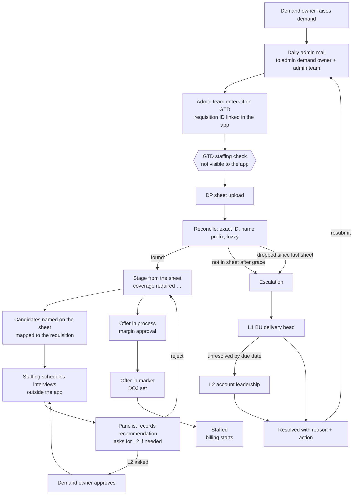
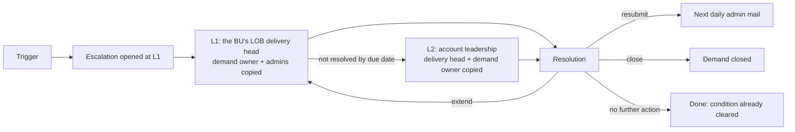

# Demand Tracker — Application Flows

Version 1.5 · 1 Oct 2026 — Phase 8 plus the 1 Oct review changes: see §17, which supersedes §9 (escalations) and the role names used above.
Scope: tracking client positions (demands) from the moment a demand owner raises them until the candidate is onboarded and billing starts. Built for Discover NA first, but every client-specific rule is account configuration so the same app works for any client.
Design decisions behind each rule are numbered D1–D67 in `docs/decisions.md`.

---

## 1. Personas

| Persona | Sees | Responsibilities in the app |
|---|---|---|
| Demand owner | Own demands (optionally read-only across own BU) | Belongs to exactly one BU (CARDS, BANKING, PAYMENTS, DATA) and raises demands for it. Owns each demand until the person is onboarded. Approves or declines extra interview rounds the panel asks for on their demands. Sees their demands' escalations. |
| Admin demand owner | Full account, all BUs | Everything the admin team does, plus: raises demands for any BU, manages User access, Account settings, the vendor rate card and interviewer profiles, approves offers at or above the margin cut-off, resolves L1 and L2 escalations, sees the account overview. |
| Admin team | Full account, all BUs | The admin demand owner's team, separate from demand owners; does the manual admin work: enters demands on GTD and records requisition IDs, uploads the DP sheet and works reconciliation, handles L1 escalations, maps candidates to requisitions, attaches CVs and records what staffing scheduled. Doesn't see client bill rates. |
| Leadership | Full account, all BUs, read-only on demands | Account overview (fill speed, pipeline, revenue lost). Resolves L2 escalations. Approves or rejects offers below the margin cut-off at their discretion. |
| Interviewer (panelist) | Interviews assigned to them and requisitions they gave feedback on | Hears about new requisitions sharing a technology with them; records recommendations (ratings, select / reject / hold, comments); asks for another round when needed. |

Outside the app (no login): GTD staffing (approve requisitions, **schedule interviews**, **email CVs**), DPs, practice and sourcing teams, the **LOB delivery head** of each BU (mailed about L1 escalations), and **Karat** (a separate interview platform, integrated through an API). Supply-side status reaches the app only through the DP Excel sheet.

### 1.1 Access control (User access page)

Everyone has limited access **except** the admin demand owner, the admin team and leadership, who always see the full account. The admin demand owner controls everyone else's access from **User access**.

| Role | Default visibility | Admin can change |
|---|---|---|
| Demand owner | Own demands, exactly one BU | Widen to own + BU read-only (never full account) |
| Interviewer | Assigned interviews; can search candidates by name to give feedback | Skills, practices, max grade, BUs (also on Interviewer profiles) |
| Admin demand owner | Full account, all BUs | Fixed |
| Admin team | Full account, all BUs | Fixed |
| Leadership | Full account, all BUs | Fixed |

The rule is enforced three times: the form offers only allowed options, the service coerces anything else, and a database constraint rejects it. Visibility is wider than edit rights: BU read-only viewers and leadership see demands they can't change. Client bill rates are shown only to the admin demand owner and leadership; a demand owner can enter one but not see it again.

Flow:
1. Admin opens **User access** → **Add user**: name, email, role, level, business unit(s), practice(s), visibility, interviewer skills and highest grade (interviewers only).
2. The role sets the visibility; the admin adjusts it where the role allows.
3. Every screen and API call filters menu and data by role and scope.
4. Deactivating a user removes access immediately; their demands and history stay. The account always keeps at least one active admin demand owner, and nobody can deactivate themselves.

### 1.2 View switcher (until login is built)

Login comes in Phase 7 (SSO). Until then a **View as** menu in the sidebar switches the whole app to any seeded user. It's a development aid, turned off by configuration in production.

### 1.3 Accounts and people in more than one

Each client is an **account**. A person's role, visibility and level belong to their **membership** of an account, so one person can work in several accounts with one login (e.g. leadership covering two clients) and a different role in each. **An interviewer belongs to exactly one account**: nobody who works in another account can be made an interviewer, and an interviewer can't be added to another account in any role. They switch accounts in the sidebar; everything they see is the current account's. Deactivating someone on User access removes them from that account only.

A **platform admin** (separate from any role inside an account) creates accounts on the **Accounts** screen: a name, time zone, a start from blank settings or a copy of another account's settings (lists, channels, DP sheet columns and status mapping, thresholds; never business units, people, rates or demands) and the first admin demand owner. They can deactivate an account: its people lose access to it, its mails and escalations stop, nothing is deleted.

### 1.4 Seed data

Seeded data has **two accounts**: Discover NA, and a made-up **Acme Insurance** with its own BUs, practices, grades, channels, DP sheet format (`seed/sample_sheet_acme.py`), ratings and thresholds. Sanjay works in both; Acme has its own interviewer (Nadia). For Discover, with placeholder people and candidates. A made-up DP sheet in the real sheet's shape (`seed/sample_sheet.py`) stands in for the 09-Sep sheet; real sheets carry candidate personal data and are never committed.

---

## 2. End-to-end flow

---

## 3. Flow 1 — Demand intake (demand owner)

1. Demand owner opens **Raise demand** and fills the form (§3.1). The admin demand owner can also raise demands, for any BU.
2. **Save draft** → status `draft`; Postgres assigns the permanent app reference, e.g. `DM-000142`. A draft can be incomplete.
3. **Submit to admin** → status `submitted`, queued for the next daily admin mail. Submitting needs practice, grade, category, primary skills, a requested start date that isn't in the past, region, location and work mode (and who is replaced, for a replacement).
4. The demand can be edited while it's a draft or submitted; once it's in an admin mail it's locked.
5. **My demands** shows every demand with its status, filters (needs attention, before GTD, linked to GTD, staffed or closed) and summary cards. Each demand has a page with details, GTD links, candidates and interviews, escalations and the stage history.

One demand = one position. **Number of positions** (1–20) creates N demands, each with its own reference.

### 3.1 Intake fields

| Group | Field | Notes |
|---|---|---|
| Position | Account | From the user's account |
| | Business unit | The demand owner's own BU; the admin demand owner picks one |
| | Practice, grade | From the account's lists (Account settings) |
| | Demand request name | Goes to GTD as `[DM-000142] …` |
| | Category | Open / Proactive (proactive covers shadow, bench, NGT) |
| | Type | New / Replacement (replacement captures who is replaced) |
| | Position type | Billable / Non-billable |
| | Client interview | Required (a panel select goes to the client next) / not required (the panel's decision is final) |
| Requirements | Primary / secondary skills | Comma-separated; used to route interviewers |
| | Experience | Min–max years |
| | Job description | PDF, Word or text, up to 5 MB |
| Commercial and timing | Client bill rate (per hour) | Write-only for demand owners; blank on edit keeps the rate on file |
| | Requested start date | Anchor for revenue loss |
| | Region, location, work mode | From the account's lists |
| | Client hiring manager | Text |

Per-account custom fields aren't used; the form's fields are enough unless a review asks for more.

---

## 4. Flow 2 — Admin mail and GTD submission

Submission to GTD is manual, so the app prompts and records.

1. **Daily admin mail**, at the account's mail time in its time zone, once a day, to every active admin demand owner and admin team member. It lists demands submitted since the last mail (they become `notified`), notes resubmissions ("resubmit, was 7QWZ2L"), and reminds about earlier ones still without an ID. The batch is recorded. If sending fails nothing changes and the next run retries. **Send admin mail now** on the GTD queue sends one immediately.
2. The admin team enters each demand on GTD with the name exactly as shown. **Download for GTD entry** gives a CSV with everything to key in.
3. They paste the requisition ID on the **GTD queue** (status → `sent_to_gtd`). IDs are stored uppercase and must be 4 to 12 letters or digits; an ID can be linked only once, ever. Submitted demands can be linked before their mail goes out.
4. A resubmitted demand's new ID chains to the one it replaces.

A demand in a mail with no ID by the next working day's mail time raises a **not submitted** escalation (§9).

---

## 5. Flow 3 — DP sheet import and reconciliation

After submission the app can't see GTD. The DP sheet is the only evidence: a row appears once GTD staffing approves a requisition.

### 5.1 Import

1. The admin demand owner or admin team uploads the **full** sheet (.xlsx) on **DP sheet import**. A filtered sheet would make demands look dropped.
2. The sheet date is read from the file name (e.g. `…9-Sep-2026.xlsx`) or entered. An **older** sheet than the latest is refused unless the uploader confirms; the **same file** can't be imported twice (use Re-run reconciliation).
3. **Which column holds what is account configuration** (Account settings → DP sheet columns), matched ignoring case and spacing, with the values that mean empty (`0` and `-` for Discover). The header row is found within the first 10 rows. A missing required column (requisition ID, request name, status, status group) stops the import and is named; a missing optional one is a warning.
4. Every row is kept as a snapshot with the original cells, and the file is kept, so imports can be compared.

Discover's sheet has one row per requisition, so each row sets its demand's stage.

### 5.2 Matching (in order, stop at the first hit)

| Tier | Rule | Who decides |
|---|---|---|
| 1. Exact | The row's requisition ID is linked to a demand (current or earlier ID) | Automatic |
| 2. Name prefix | `[DM-xxxxxx]` in the request name, and that demand has no ID yet | Automatic: the ID is recorded from the sheet and listed in the summary |
| 3. Fuzzy | Score 0–100 from name similarity (35%), originator vs owner (20%), practice (15), grade (10), region (5), start date within ±7 days (up to 15); up to three suggestions from 60 | A person confirms |

- A prefix pointing at a demand that already has a different ID is a **conflict** for a person to settle.
- Identical bulk demands are offered as interchangeable slots, in reference order.
- A person can instead match the row to **any open demand** (a mistyped ID gets the new ID, chained to the old one) or **create the demand from the row**: the owner is pre-picked when the sheet's originator matches a user; otherwise the admin picks, and a BU is needed when the owner is the admin demand owner.
- The same requisition twice in a sheet: only the first row counts. A row without an ID is flagged.

### 5.3 Outcomes

| Outcome | Condition | Result |
|---|---|---|
| Found | Row matched | Stage from the sheet (§6) |
| Awaiting GTD | Linked, not in the sheet, within the grace period (working days from the day the ID was linked, to the sheet date; Account settings) | No action |
| Missing | Linked, not in the sheet after the grace period | Status `missing`, escalation |
| Dropped | In the previous sheet, gone from this one, still open, judged on the demand's **current** ID | Status `dropped`, escalation. Staffed, cancelled and closed demands leave quietly |
| Incorrect demand | The sheet marks it "In Correct Demnad" | Status `incorrect`, escalation |
| Unknown status | The row's status has no mapping | Demand stays Linked; warning links to the mapping settings |
| Needs a person | Fuzzy suggestion, no match, or conflict | Listed on Reconciliation |

Reconciliation also: adds the **candidates** named on each row to that requisition (§7), raises an **offer approval** when a row reaches Offer in process with a candidate (§8), and sends **interviewer alerts** once per new requisition (§7).

Only the **latest** import is reconciled or acted on; older ones are shown read-only. Re-running is safe: nothing repeats, and people's matches are kept. The screen shows sent / in sheet / awaiting / missing / dropped / to match, each problem with its escalation, and the stage changes the sheet caused.

---

## 6. Flow 4 — Coverage lifecycle (after linking)

Once linked, the demand's stage comes from the sheet's `Status` / `Status Group` through the account's status mapping (Account settings). Only coverage stages, cancelled and incorrect can be mapped to.

### 6.1 Supply channels (Discover NA; configurable per account)

| Channel | Sheet marker | Needs GetTalent req + sourcer |
|---|---|---|
| GTD supply (internal bench) | `GTD Supply Suggested` | No |
| Sogeti (sister company) | `Sogeti Supply` | No |
| Subcon via VMS | `Subcon VMS Shortlists` | Yes |
| FTE external hire | `FTE` | Yes |

A row's Source cell (e.g. `VMS`, `Sogeti`) is matched to a channel for offers and candidates.

### 6.2 Status mapping (Discover NA, from the 09-Sep sheet)

| Status group | Status | App stage |
|---|---|---|
| Work in Progress | Coverage Required | Coverage required |
| Profiles with Client | CI to be Scheduled | Profiles with client |
| Offer in Market/Process | Offer in Process | Offer in process |
| Offer in Market/Process | Offer in Market | Offer in market |
| Staffed | Allocation Pending | Staffed |
| Cancelled/Abandon | Demand to be Cancelled | Cancelled |
| *(blank)* | In Correct Demnad | Incorrect demand → escalation |

### 6.3 Stages

1. **Coverage required** — sourcing across the channels.
2. **Interviewing** — a candidate is in the panel (set by the app from interview records, §7).
3. **Selected by panel** — a candidate was selected and the demand needs a client interview (set by the app).
4. **Profiles with client** — client interview.
5. **Offer in process** — client selected, or the panel selected on a demand with no client interview; margin approval (§8).
6. **Offer in market** — offer out, BGV, DOJ set.
7. **Staffed** — allocation; billing starts on DOJ.

**Sheet vs panel.** The DP sheet lags the panel by about a week, so the app moves a demand forward on panel records the day they're entered. A sheet that still says Linked or Coverage required doesn't pull it back (listed on Reconciliation as "sheet behind the panel"); a sheet stage further on always wins.

Every stage change is a timestamped stage event (from the app or from an import), which feeds aging and the history on the demand page.

---

## 7. Flow 5 — Interviews

**Staffing schedules interviews outside the app and sends CVs by email.** So the app doesn't schedule; it makes sure each candidate is tied to the right requisition, and captures the panelist's recommendation.

1. **Candidates and their requisition.** A candidate belongs to at most one requisition (the same person on another requisition is a separate record) and can exist before anyone knows which. They come from:
   - the DP sheet's **Candidate Name** cell on the requisition's row (one name per line);
   - a panelist or the admin team adding them;
   - **Karat** results (§7.1).
   Candidates without a requisition wait on **Candidates → No requisition yet**; mapping moves their interviews with them, and mapping onto a requisition that already has that person merges the records.
2. **Heads-up.** When a requisition is first seen in a DP sheet at an interview stage, every active interviewer sharing **at least one technology** with it (skills on the demand vs the interviewer's skills) gets one mail. **My interviews** lists open requisitions in their skills.
3. **Recording what staffing arranged.** On **Candidates**, the admin team records rounds as far as they're known: L1 or L2, the interviewer ("not known yet" is allowed) and the time. Who takes an L2 is still to be decided, so it's a placeholder they fill in.
4. **Invite.** When an interviewer is assigned they get a mail titled `[2ZT7KP | DM-000142] L2 – Candidate name` with the time, required skills, JD link, CV link and a **feedback link that works without signing in, once**.
5. **Recommendation.** From the mail link, from an assigned interview on **My interviews**, or for **any candidate found by name** (the panelist can confirm the requisition while doing it): ratings 1 to 5 on the account's dimensions (Technical depth, Problem solving, Communication), **select / reject / hold**, comments (required to reject or hold), and optionally **needs another round** with a reason.
6. **Another round.** "Needs another round" creates an L2 request and mails the demand owner, who approves or declines it on the demand page (declining needs a note; the admin demand owner can decide too). Approved, it waits for staffing to schedule it and someone to be assigned. A rejected candidate can't go on; L2 is the last round.
7. **CVs** are attached on Candidates by the admin roles; the invite's CV link works while the feedback link is live.

Every recommendation is an interview record with its date, so the rejection count and the panel deadline (§9) are exact.

8. **Stage follows the panel.** After every schedule, recommendation, round decision or mapping: a candidate in play → **Interviewing**; a candidate selected with nothing pending → **Selected by panel** if the demand needs a client interview, otherwise **Offer in process** (offer approval raised). All candidates rejected → back to Coverage required. The demand owner is mailed when a candidate is selected. Whether a client interview is required is set when the demand is raised.

Interview statuses: waiting for demand owner (an asked-for round) → declined, or to be scheduled → scheduled (interviewer assigned, link sent) → feedback in.

### 7.1 Karat

Karat is a separate interview platform. The app accepts its results at `POST /api/integrations/karat/results` (API key; off until configured): candidate name, GTD requisition ID if known, round, outcome, report link, Karat's own ID. It maps by requisition ID when given, otherwise leaves the candidate for the admin team to map, and ignores a result it has already received. Karat's actual API or export still has to be agreed (§13).

---

## 8. Flow 6 — Offer approval and rate card

1. The admin demand owner maintains the **vendor rate card**: cost per hour by grade, practice (blank = any; a practice-specific rate wins), region and supply channel, with effective from/to. Rates are history: a rate is never edited; a new rate takes over from its start date and the previous one ends the day before; overlaps are refused. Rates can be added one at a time or **uploaded in bulk** (.csv or .xlsx, all or nothing, every bad row listed); the download is in the same format and doubles as the template.
2. When a DP sheet row moves a demand to **Offer in process** and names a candidate, the app raises an **offer approval** for that candidate (once). The admin demand owner can raise one by hand when the sheet has no name, and set a missing supply channel.
3. **Margin** = (client bill rate − vendor cost rate) ÷ client bill rate, using the rate card **on the offer date** (later rate changes don't move old offers).
4. Margin **at or above the cut-off** (30% for Discover, Account settings) → the admin demand owner approves or declines.
5. Margin **below the cut-off** → leadership decides at their discretion; approving needs a comment giving the reason.
6. A decline always needs a comment. An offer missing its bill rate, channel or rate card entry waits unpriced with the reason shown, and is re-priced when the approvals screen loads or the rate card changes.
7. Every decision records approver, margin and time. The approval doesn't move the demand's stage; the DP sheet does.

---

## 9. Flow 7 — Escalation engine

Anything missed escalates **by default**. Escalations open automatically and are closed only by a person, with a reason and an action.

### 9.1 Triggers

| Type | Trigger | Threshold (Account settings) |
|---|---|---|
| Not submitted | In an admin mail, still no requisition ID at the next working day's mail time | 1 working day |
| Missing | Linked, not in the DP sheet after the grace period | Grace period, working days (3) |
| Dropped | In the previous DP sheet, gone from the latest, still open | Immediate |
| Incorrect demand | DP sheet status "In Correct Demnad" | Immediate |
| Aging | A linked demand with no stage change | Aging days (14) |
| Rejection limit | Panel rejections recorded on the requisition | Limit (3) |
| Panel SLA | A scheduled interview with a known time has no feedback | Panel hours (48) |
| Past start date | Start date passed, demand open and past draft, and the latest DP sheet shows no DOJ or a DOJ after the start | Immediate |

Missing, dropped and incorrect are opened by reconciliation; the rest by the **sweep**, which runs every two hours (and from **Run sweep now** for the admin roles). There's at most one open escalation per demand and type.

### 9.2 Ladder

- **L1** is due after the account's L1 working days; mailed to the BU's **LOB delivery head** (name and email per BU in Account settings; if none, the admin demand owner), with the demand owner, admin demand owner and admin team copied.
- Past its due date the sweep **promotes it to L2**, due after the L2 working days, mailed to **leadership** with the delivery head and demand owner copied. L2 past due stays L2.
- Each group of recipients gets one mail per sweep about everything they haven't heard of yet; a failed mail is retried on the next sweep.

### 9.3 Resolution

- **Who:** L1 by the admin demand owner or admin team; L2 by leadership or the admin demand owner.
- **Reason** from the account's list: failed GTD basic checks, no coverage available, duplicate demand, withdrawn by client, client budget pending, unknown.
- **Action:**
  - *Send back to demand owner for correction* (link problems only): the demand becomes Returned for correction and the owner is mailed the reason and what to fix. The owner edits and resubmits; it goes into the admin mail as a resubmission and its new GTD ID chains to the old one. Its other open link escalations close with it.
  - *Resubmit* (link problems only): for a demand that is right as it is. It goes back to Submitted and into the next admin mail; its new GTD ID chains to the old one. Its other open link escalations close with it.
  - While a demand is being corrected or resubmitted, and after it has a new ID, sheet rows for its old ID are ignored (listed on Reconciliation), so they can't reopen the escalation or mark it dropped.
  - *Extend due date:* stays open, back at L1, with the new date.
  - *Close demand:* the demand is closed and all its open escalations close with it.
  - *No further action:* only once the condition has cleared (e.g. the ID was linked a day late); the screen shows when a condition has cleared.
- A comment is optional. Every open, mail, promotion, extension and resolution is recorded with who and when; demand owners see their demand's escalations on the demand page.

---

## 10. Flow 8 — Start date and revenue loss

- **Days late** = (DOJ or today) − requested start date, when positive, counted to today at most.
- **Revenue lost to date** = hourly client bill rate × billable hours per day (Account settings, default 8) × **working** days late.
- A DOJ still in the future adds a separate **projection** ("more by the DOJs set").
- Staffed demands that joined late keep their loss; draft, cancelled and closed demands don't count. A late demand with no bill rate is counted as late but its loss is shown as unknown, never guessed.
- The **Account overview** (leadership and the admin demand owner; the admin demand owner still lands on All demands) shows: open demands, still need coverage, past start date unfilled (with the range of days late), revenue lost to date; open escalations and offers waiting for the viewer; pipeline by stage; the revenue-at-risk list; breakdowns by practice and by BU.

---

## 11. Status catalogs

### 11.1 Demand

| Phase | Status | Set by |
|---|---|---|
| Before GTD | `draft`, `submitted`, `notified`, `returned`, `sent_to_gtd` | App |
| Linking | `linked`, `missing`, `dropped`, `incorrect` | Reconciliation |
| Coverage | Coverage required → Interviewing → Selected by panel → Profiles with client → Offer in process → Offer in market → Staffed | DP sheet (mapped); Interviewing, Selected by panel and a panel-final Offer in process from interview records |
| End | `cancelled`, `closed` | DP sheet, or an escalation resolved with "close" |

### 11.2 Interview

| Status | Meaning |
|---|---|
| Waiting for demand owner | An extra round the panelist asked for |
| Extra round declined | The demand owner said no, with a note |
| To be scheduled | Needed or recorded; no interviewer assigned yet |
| Scheduled | Interviewer assigned; invite and feedback link sent |
| Feedback in | Recommendation recorded (from the app, the link or Karat) |

---

## 12. Answered questions

**24 Sep, before Phase 2**
1. Who submits on GTD: the admin demand owner and their admin team (a separate team doing the manual admin work).
2. Not submitted: in the mail with no requisition ID by the next day's mail time.
3. DP sheet delivery: manual upload by the admin demand owner or admin team.
4. Grace period: an Account setting.
5. Offers below 30%: leadership approves or rejects at their discretion.
6. L2 interviews: the panelist asks, the demand owner approves.
7. BUs per demand owner: exactly one; only the admin demand owner spans BUs.
8. The admin team also handles escalations.

**Before Phase 3:** read the real sheet's headers and statuses only; every upload is the full sheet; grace counts from the day the ID is linked; finished demands leaving the sheet don't escalate; name-prefix matches link automatically; a demand created from a row is owned by the matching originator, otherwise the admin picks; an older sheet needs confirming.

**After Phase 4:** L1 goes to a per-BU delivery head (name and email in settings, not a user); "no further action" allowed once cleared; the admin demand owner can also resolve L2.

**After Phase 5:** revenue loss stays working days × billable hours (an account setting); the overview is for leadership and the admin demand owner.

**Before Phase 6:** requisition IDs stay 4 to 12 characters; no custom fields unless a review asks; rates both on screen and by bulk upload; staffing schedules L1 and L2 outside the app; CVs come from staffing by email; Karat is a separate app to integrate; interviewers match on one shared technology; rejection limit counts panel rejections recorded in the app; panel SLA is 48 hours from the scheduled time.

---

## 13. Still open

1. **Who takes the L2 interview.** A placeholder the admin team fills in until decided.
2. **Karat.** Its API or export, what it sends (candidate, requisition or job, result, report link) and how it authenticates.
3. **CVs from staffing's email.** Uploaded by hand today; reading them from a mailbox automatically is a later step.
4. **Real vendor rates.** The rate card holds made-up numbers until Discover's rates are uploaded.
5. **Login.** SSO (Phase 7) replaces the View-as switcher; access rules stay on User access.

---

## 14. Changes in 1.2

- §1: admin team and admin demand owner roles as built; people outside the app (staffing schedules interviews and sends CVs, BU delivery heads, Karat).
- §3–§4: edit window, submit rules, write-only bill rate, N positions, GTD export, requisition ID format, mail timing and retries.
- §5: column mapping in settings, older and duplicate uploads, prefix auto-link and conflicts, fuzzy scoring, create-from-row ownership, grace from link date, dropped only for open demands on their current ID, unknown statuses, latest-import-only.
- §7: rewritten around mapping candidates to requisitions and capturing recommendations; L2 request and approval; invite and single-use feedback link; alerts on one shared technology; Karat.
- §8: dated rate card with bulk upload; offers raised from the sheet; pricing on the offer date; comments; unpriced offers.
- §9: precise triggers, sweep, delivery heads and leadership as L1/L2, who resolves, "no further action", audit trail.
- §10: working-days loss formula, projection, what counts, overview contents and audience.
- §11–§13: interview status catalog, all answers so far, open items.

## 15. Changes in 1.3

- §3.1: *client interview required* on the demand (does a panel select go to the client, or is the panel final).
- §6.3, §7, §11: Interviewing and Selected by panel stages, set from interview records the day they're entered; a lagging sheet doesn't undo them.
- §9.3: *send back to demand owner for correction* (Returned for correction); old or outgoing requisition IDs in the sheet are ignored.
- §8: the demand owner sees each offer's approval progress (no rates or margin) and is mailed the decision; the date of joining and candidate stages follow the DP sheet (D51–D52).

## 16. Changes in 1.4 (Phase 8, second account)

- §1.1, §1.3: role, visibility and level per account membership; account switcher; platform admin and the Accounts screen (D53–D55).
- §1.4: Acme Insurance seeded as a second, differently configured account.
- Account settings also hold the interview rating dimensions and the L1/L2 escalation owner labels (D56).

## 17. Changes in 1.5 (review of 1 Oct)

Where this section differs from the text above, this section is what is built.

**Roles.** Administrator (app controls only: User access, Account settings, Rate card, Accounts; no
demands) · GTD team admin (was admin demand owner) · GTD admin team (was admin team) · demand owner ·
leadership · interviewer. The GTD team admin asks the Administrator for control changes through
*Requests*, by email both ways.

**Intake.** A replacement needs the leaver's last working day. The name goes to GTD as typed, with no
DM reference. Mail: on submit (GTD admin team, owner copied) → every morning until created on GTD →
completion mail when the requisition ID is linked.

**Revenue loss** counts from the requested start date, or from the day after the LWD when that is later.
Demand owners see the loss on their own demands.

**Escalations (replaces §9.2–§9.3).**

| Trigger | Responsible (default) | Severity (default) |
|---|---|---|
| Not submitted | GTD admin team | Medium |
| Missing from sheet | GTD admin team | Medium |
| Dropped from sheet | Demand owner | High |
| Incorrect demand | Demand owner | Medium |
| Aging | Demand owner | Low |
| Past start date | Demand owner | High (always, when billable) |
| Rejection limit | Demand owner | Medium |
| Late panel feedback | Interviewer | Low |

1. A trigger fires; the escalation takes its rule's responsible party and severity.
2. **L1:** the responsible person is mailed what happened, the steps to take and the date to respond by
   (1, 2 or 3 working days for high, medium, low). The demand owner and GTD team admin are copied.
3. They respond with a reason and an action: send back / correct and resubmit, resubmit as is, ask
   for more time, revise the start date (past start), close the demand, or no further action once
   the condition has cleared. Only the responsible party can respond.
4. **L2:** if the date passes, leadership and the BU delivery head are informed. The same person still
   has to act and is reminded once a day. More time keeps the level.
5. Late feedback closes itself when the feedback is submitted.

Every part of this is an account setting the Administrator edits: each trigger on or off, who is
responsible, its severity and steps, the days per severity, and who is informed at L2.

**Offers.** A demand owner can ask for the offer approval for a panel-selected candidate. The margin
calculator gives the GTD team admin and leadership a what-if per supply channel.

**Non-billable positions** are capped per business unit by the GTD team admin; leadership sees used
against agreed.
